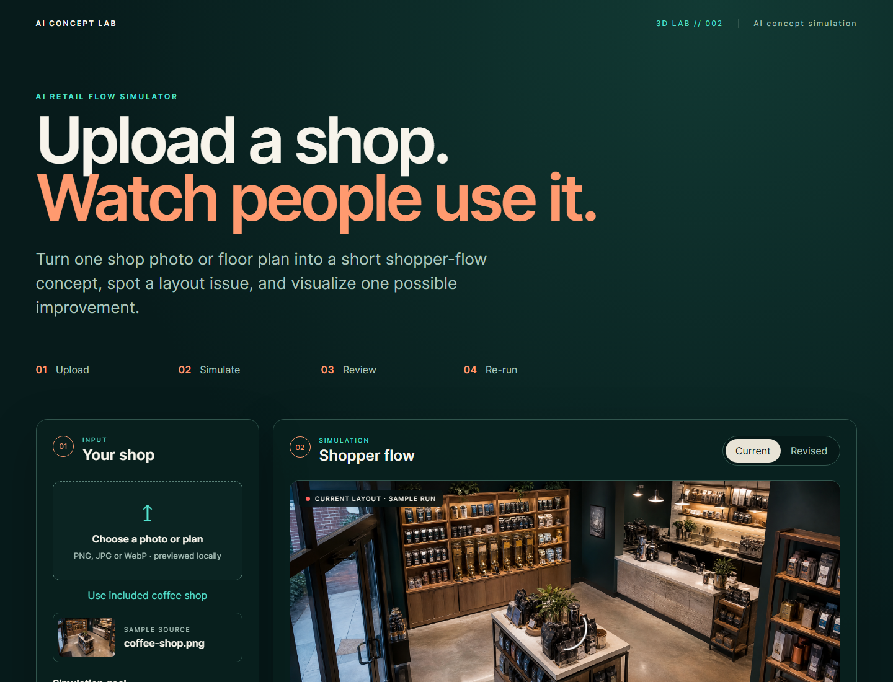

# 3D LAB // 002 — AI Retail Flow Simulator

**Upload a shop. Watch people use it.**

A small, runnable product concept that turns a shop image into an AI-generated shopper-flow video, records visible layout observations, and compares one revised layout. Part of [AI Concept Lab](https://github.com/aiconceptlab).



The repository includes two real 8-second Higgsfield Cinema Studio generations:

- **Current layout:** shoppers converge beside a central display island.
- **Revised layout:** the island moves to the perimeter and the central route opens.

The included source and revised images were generated with GPT Image 2 through the connected Higgsfield workflow. Both videos were generated with **Higgsfield Cinema Studio Video**, from fixed 16:9 start frames.

> These are AI concept simulations. They are useful for discussing a layout hypothesis, but they do not measure footfall, predict sales, validate accessibility, or replace observation in the real shop.

## Run it

Install Node.js 22 or newer:

```sh
npm ci
npm start
```

Open http://127.0.0.1:3014.

No account, API key or external service is required to play the bundled sample. The server supports byte-range requests, so the MP4 files seek and play correctly in modern browsers.

## Try the product flow

1. Use the included coffee shop or select your own PNG, JPG or WebP. Custom images are previewed locally and are not uploaded.
2. Play the **Current** sample simulation.
3. Review the three visible observations.
4. Choose **View revised simulation** to compare the proposed layout.
5. Download the Higgsfield brief to reproduce the workflow with another shop image.

The public starter deliberately avoids pretending that a browser upload was automatically sent to Higgsfield. The two sample runs are bundled and labelled. To generate a custom run, use the exported prompt brief with Higgsfield and replace the sample assets.

## File map

```text
public/
  index.html                 Product UI
  app.js                     Upload preview, run switching, prompt export
  style.css                  Responsive frontend
  assets/
    current-shop.png         Fixed source frame
    current-flow.mp4         Current-layout simulation
    revised-shop.png         One proposed layout edit
    revised-flow.mp4         Revised-layout simulation
sample/
  observations.json          Claims and provenance used by the sample
docs/
  higgsfield.md              Reproduction workflow and exact prompts
marketing/
  instagram-4x5/             Five 1080 × 1350 Instagram slides
  caption.txt                Instagram caption
  comment-dm-templates.md    CODE reply templates
```

## Verify

```sh
npm run check
npm run render:instagram
```

The checks validate source files, media signatures, honest claim language, the HTTP server, security headers and MP4 range requests. The app was also reviewed in a desktop browser and at a 390 px mobile viewport; both bundled videos were played and scrubbed.

## Cost and plan note

For this release, the image generations cost 2 credits each and each 8-second Cinema Studio video cost 8 credits. Prices and model access can change. A Seedance 2.5 attempt was rejected before submission because that model required Plus on the connected account; no Seedance video credits were spent.

Higgsfield's official help centre describes Cinema Studio as its controlled cinematic video workflow and documents image/video generation through connected AI agents. See [BUILD.md](BUILD.md) for checked references and the exact release record.

## License

MIT for the starter code and original project copy. Generated sample media is supplied for this demonstration repository. Vendor names are used descriptively; no affiliation or endorsement is implied.
